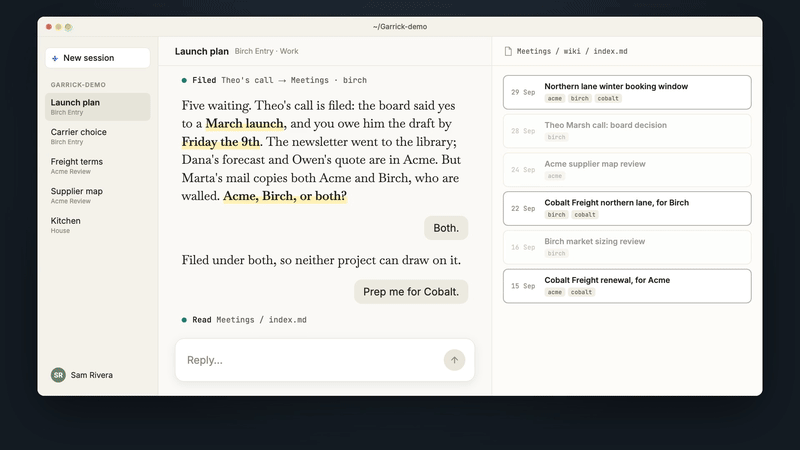

# Garrick

[](https://github.com/iamvenuti/garrick/actions/workflows/tests.yml) [](LICENSE)  

**Pick up any project where you left it, with its decisions, source material and next action kept in files you own.**

Garrick gives Claude Code or Codex a workspace for your work and your memory. Ask it to file a conversation, prepare a brief or close a session. It keeps the record in plain folders on your Mac, so another session can pick up from the saved notes.

Your work may involve customers, partners under NDA and internal projects. Garrick records whose information you hold, gives the assistant rules for using it, and checks project files for specific signs of information crossing a declared boundary.

[](https://github.com/iamvenuti/garrick/releases/download/v0.1.0/garrick-launch-video.mp4)

*[Watch the 84-second walkthrough](https://github.com/iamvenuti/garrick/releases/download/v0.1.0/garrick-launch-video.mp4) ([captions](https://github.com/iamvenuti/garrick/releases/download/v0.1.0/garrick-launch-video.srt)). Dramatised with fictional data; it illustrates the intended workflow.*

## Choose how you work

Both routes use the same files, rules and skills. You can change routes later.

| If you prefer… | Start here | What you need |
|---|---|---|
| A normal app window, with help setting up if wanted | [Desktop first steps](docs/first-steps.md), or a [guided session](docs/guided-session.md) | Claude's desktop app in Code mode, or Codex in the ChatGPT desktop app. Terminal is used for installation; daily work happens in the app. |
| A terminal and tools you choose yourself | [Terminal setup](docs/terminal-setup.md) | Claude Code or Codex CLI. A provider's desktop app is optional. Add Obsidian for browsing or cmux for several sessions when useful. |

Already set up? [Your first useful session](docs/first-session.md) takes one conversation through filing, a brief and a saved next action. Start with one project; add the rest as you need it.

[Phone access](docs/extras/phone-access.md) is optional for either route. For example, Codex remote voice on iPhone can answer from your Garrick workspace while your laptop is at home, awake and connected. That route needs the ChatGPT desktop host app even if you normally work in a terminal.

## What Garrick keeps for you

- **A place to resume.** Each line of work has a note with the current decision, next action and deadline. Say “wrap it” before leaving and “open [thread]” when you return.
- **Two kinds of memory.** Meetings keeps conversations and correspondence with their sources. Knowledge keeps published material you read.
- **Declared information boundaries.** You choose which pairs of parties must be kept apart. The assistant checks those rules before using a conversation for a project. A commit check catches specified names, links and copied wording in supported text files.
- **Files you own.** Notes and history stay in the workspace. Claude Code and Codex can read the same record; their private chat history and app settings are separate.
- **Short, speakable requests.** Use your app's voice features or dictation. Garrick supplies the naming and reply conventions; the app supplies the microphone and voice connection.

**What the walls mean:** they are rules for the assistant, backed by limited checks before a commit. Separate folders do not create a wall automatically. A clean paraphrase can pass, and generated Word, PowerPoint and PDF contents are outside the text scan. The hook does not block chat replies, initial file writes or sending. Review anything you intend to share. [Principles and limits](docs/principles.md#what-the-check-covers) explain the scope.

## Who it's for

People holding confidences from several sources: advisors, account managers, people working with partners under NDA, and teams' individual members handling separate internal projects. For two internal projects to have a wall, give them separate party tags and declare the pair, even if both belong to one company.

At work, use the assistant and account your employer approves. Files stay on your disk, but content the assistant reads goes to its provider. Garrick does not control the provider's retention or training settings.

## Try the fictional workspace

On a Mac with git, Python 3.9+ and Claude Code or Codex ready:

```sh
git clone https://github.com/iamvenuti/garrick.git
cd garrick
python3 examples/demo/build.py --target ~/Garrick-demo
```

Open `~/Garrick-demo` in your chosen app or terminal assistant and say “what's open”. The [first-session guide](docs/first-session.md#try-the-wall-with-fictional-data) gives you a short wall demonstration. The demo builder writes only inside that target folder; your assistant keeps its own session data separately. [Try it safely](docs/try-it-safely.md) explains removal.

When you want your own, run `python3 install.py` from the downloaded repository. It asks one question at a time and writes into a new folder, `~/Garrick` by default. [Getting started](docs/getting-started.md) is the command reference.

## How the files fit together

A **zone** is a side of your life, such as Work or Personal, with its own folder and git history. A **project** holds one undertaking. A **thread** is a line of work inside it, with one resume note. Meetings and Knowledge hold the source material those projects can draw on under the rules.

<details>
<summary>See the workspace diagram and optional tools</summary>


Download the [interactive diagram](docs/architecture/overview.html) and open it in a browser. The diagram shows optional tools as well as the workspace. Desktop users can talk to the assistant directly in their app.

</details>

## Core and extras

Garrick is the installer, workspace template, rules, skills and Python tools. It needs git, Python and an assistant that can read and edit local files and run the tools. It has no desktop app of its own.

[Extras](docs/extras/index.md) include Obsidian, cmux, a meeting recorder, mail fetching, phone access and scheduled jobs. Add one when it solves a problem you have; none is required for the first session.

## Status and documentation

Early, for macOS. See the [changelog](CHANGELOG.md).

- [Desktop first steps](docs/first-steps.md) and [terminal setup](docs/terminal-setup.md).
- [Your first useful session](docs/first-session.md) and [guided setup](docs/guided-session.md).
- [Command reference](docs/getting-started.md), [principles and limits](docs/principles.md), and [assistant compatibility](docs/harnesses.md).
- [The demo workspace](examples/demo/README.md) and [the introduction](presentation/index.html) (download and open in a browser).

## Contributing

Issues and ideas are welcome; read [CONTRIBUTING.md](CONTRIBUTING.md) first. Report a bypass of a documented check through [SECURITY.md](SECURITY.md), using fictional data.

## Licence

MIT. See [LICENSE](LICENSE).
