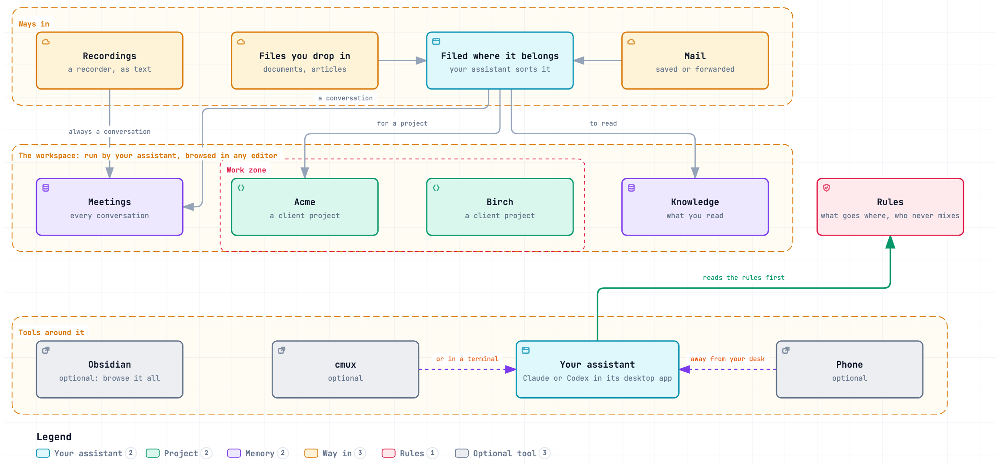

# Garrick

[](https://github.com/iamvenuti/garrick/actions/workflows/tests.yml) [](LICENSE)  

**Garrick remembers your work and knows whose confidences you hold.**

An AI chief of staff for your knowledge work, running on the agent you already use. Everything stays in files you own.

Underneath, Claude Code or Codex does the work, in its desktop app or a terminal. Ask Garrick to file a conversation, prepare a brief or close a session. It keeps the record in plain folders on your Mac, so the next session picks up from the saved notes, whichever agent runs it.

Your work may involve customers, partners under NDA and internal projects. Garrick records whose information you hold, gives the agent rules for using it, and checks project files for specific signs of information crossing a declared boundary.

https://github.com/user-attachments/assets/83ce60b8-a4d4-402f-bc24-804eaddda3c1

*The walkthrough, 98 seconds, with [captions](docs/assets/garrick-launch-video.srt). Dramatised with fictional data; it illustrates the intended workflow.*

## Start small

![Start small. Climb when you want to. Level 1, Organise: Claude or Codex in its desktop app and the Garrick folders, for a resume point for every piece of work, meetings and knowledge kept locally, and walls between the parties you declare. Level 2, Feed it: inbox folders, mail alias ingestion and recorder transcripts, so conversations and mail are filed for you. Level 3, Own the interface: Obsidian to browse, cmux for parallel sessions and Garrick's Status to see it all, so your work no longer lives inside one vendor's app and one page shows where it all stands. Level 4, Work from anywhere: the assistants' remote and voice features, so your workspace answers from your phone. Each level works on its own.](docs/assets/adoption-ladder.png)

1. **Organise:** [first steps](docs/first-steps.md), then [your first useful session](docs/first-session.md).
2. **Feed it:** [ways in](docs/extras/ways-in.md) for mail and files, and [a meeting recorder](docs/extras/meeting-recorder.md).
3. **Own the interface:** [terminal setup](docs/terminal-setup.md), [Obsidian](docs/extras/obsidian.md), [cmux](docs/extras/cmux.md) and [the status page](docs/extras/status-page.md).
4. **Work from anywhere:** [phone access](docs/extras/phone-access.md).

## Choose how you work

Both routes use the same files, rules and skills. You can change routes later.

| If you prefer… | Start here | What you need |
|---|---|---|
| A normal app window, with help setting up if wanted | [Desktop first steps](docs/first-steps.md), or a [guided session](docs/guided-session.md) | Claude's desktop app in its Code tab, or Codex in the ChatGPT desktop app. Terminal is used for installation; daily work happens in the app. |
| A terminal and tools you choose yourself | [Terminal setup](docs/terminal-setup.md) | Claude Code or Codex CLI. A provider's desktop app is optional. Add Obsidian for browsing or cmux for several sessions when useful. |

Already set up? [Your first useful session](docs/first-session.md) takes one conversation through filing, a brief and a saved next action. Start with one project; add the rest as you need it.

[Phone access](docs/extras/phone-access.md) is optional for either route. For example, Codex remote voice on iPhone can answer from your Garrick workspace while your laptop is at home, awake and connected. That route needs the ChatGPT desktop host app even if you normally work in a terminal.

## What Garrick keeps for you

- **A place to resume.** Each line of work has a note with the current decision, next action and deadline. Say “wrap it” before leaving and “open [thread]” when you return.
- **Two kinds of memory.** Meetings keeps conversations and correspondence with their sources. Knowledge keeps published material you read.
- **Declared information boundaries.** You choose which pairs of parties must be kept apart. The assistant checks those rules before using a conversation for a project. In supported text files, a commit check catches links and names from across a wall, and wording copied from a walled meeting, its transcript or another party's project files.
- **Files you own.** Notes and history stay in the workspace. Claude Code and Codex can read the same record; their private chat history and app settings are separate.
- **Short, speakable requests.** Use your app's voice features or dictation. Garrick supplies the naming and reply conventions; the app supplies the microphone and voice connection.

**What the walls mean:** they are rules for the assistant, backed by limited checks before a commit. Separate folders do not create a wall automatically. A clean paraphrase can pass, and so can wording moved rather than copied from one party's note to another's. Generated Word, PowerPoint and PDF contents are outside the text scan. The hook does not block chat replies, initial file writes or sending. Review anything you intend to share. [Principles and limits](docs/principles.md#what-the-check-covers) explain the scope.

## Who it's for

People holding confidences from several sources: advisors, account managers, people working with partners under NDA, and members of a team who handle separate internal projects. For two internal projects to have a wall, give them separate party tags and declare the pair, even if both belong to one company.

At work, use the assistant and account your employer approves. Files stay on your disk, but content the assistant reads goes to its provider. Garrick does not control the provider's retention or training settings.

## Try the fictional workspace

On a Mac with git, Python 3.9+ and Claude Code or Codex ready:

```sh
git clone https://github.com/iamvenuti/garrick.git ~/garrick-source
cd ~/garrick-source
python3 examples/demo/build.py --target ~/Garrick-demo
```

Open `~/Garrick-demo` in your chosen app or terminal assistant and say “what's open”. The [first-session guide](docs/first-session.md#try-the-wall-with-fictional-data) gives you a short wall demonstration. The demo builder writes only inside that target folder; your assistant keeps its own session data separately. [Try it safely](docs/try-it-safely.md) explains removal.

When you want your own, run `python3 install.py` in `~/garrick-source`. It asks one question at a time and writes into a new folder, `~/Garrick` by default. [Getting started](docs/getting-started.md) is the command reference.

## How the files fit together

A **zone** is a side of your life, such as Work or Personal, with its own folder and git history. A **project** holds one undertaking. A **thread** is a line of work inside it, with one resume note. Meetings and Knowledge hold the source material those projects can draw on under the rules.

<details>
<summary>See the workspace diagram and optional tools</summary>



Download the [interactive diagram](docs/architecture/overview.html) and open it in a browser. The diagram shows optional tools as well as the workspace.

</details>

## Core and extras

Garrick is the installer, workspace template, rules, skills and Python tools. It needs git, Python and an assistant that can read and edit local files and run the tools. It has no desktop app of its own.

[Extras](docs/extras/index.md) include Obsidian, cmux, a meeting recorder, mail fetching, phone access, scheduled jobs and a status page, Garrick's Status, which opens in a browser or in its own Mac app. Add one when it solves a problem you have; none is required for the first session.

## Status and documentation

Early, for macOS. See the [changelog](CHANGELOG.md).

- [Desktop first steps](docs/first-steps.md) and [terminal setup](docs/terminal-setup.md).
- [Your first useful session](docs/first-session.md) and [guided setup](docs/guided-session.md).
- [Command reference](docs/getting-started.md), [principles and limits](docs/principles.md), and [assistant compatibility](docs/harnesses.md).
- [Updating to a newer Garrick](docs/updating.md), keeping what you changed.
- [The demo workspace](examples/demo/README.md) and [the introduction](presentation/index.html) (open it in a browser from your downloaded copy, which holds its images).

## Contributing

Ask questions and give feedback in [Discussions](https://github.com/iamvenuti/garrick/discussions).

Issues and ideas are welcome; read [CONTRIBUTING.md](CONTRIBUTING.md) first. Report a bypass of a documented check through [SECURITY.md](SECURITY.md), using fictional data.

## Licence

MIT. See [LICENSE](LICENSE).
