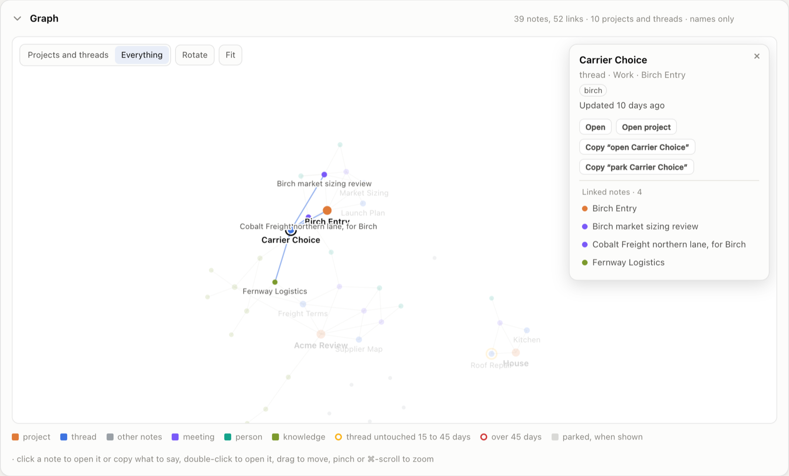

# Extra: a status page

One page, Garrick's Status, that answers two questions before you open anything: is anything wrong, and where was I? It is a single HTML file you open in a browser, or in a small [Mac app](#a-mac-app) of its own. It needs no server, no account and no network, and it works whether or not you use Obsidian or cmux: each time it is built, it checks which of them this machine has and offers only what will work.

## What it shows

- **A graph of the workspace**: every note in your zones and wikis, and the links between them, laid out to fill its card. *Projects and threads* and *Everything* switch how much it shows. Click a note for its links and the same actions a thread's card offers; double-click opens it. [Reading the graph](#reading-the-graph) says what it draws and what it leaves out.
- **Threads**, one column per zone: every live thread, by name, with its project, its party and how long since its note was updated. The bar fills toward sixty days and turns amber after 14 days, red after 45. Threads you have parked ("park X") sit in a folded *Parked* group at the foot of their zone, also by name, out of the counts. Hover a thread for its card.
- **Checks**: what `System/tools/check.py` finds, run as the page is built, grouped by check.
- **Open actions**: the unticked items in each zone's `Todo.md`, counted by section, with an *Open* link to the list. A zone without a `Todo.md` is left out, and with none at all so is the card; the check reports the missing file.
- **Inboxes**: what is waiting to be filed in each zone's `Inbox/` and in the Meetings inbox.
- **Scheduled jobs and assistant calls**, when you use the [scheduled jobs](scheduled-jobs.md) extra: a fourteen-day strip per job, one cell per day, and the spend against its caps. The caps are the ones the jobs run under: the `GARRICK_CAP_*` values in the launchd plists of the jobs that call the assistant, with the default for any a plist leaves out and the lowest where jobs differ. With no such plist, the page shows the caps it was built with, and the card says which it used. A cap set to 0 shows as *no cap*. A job the cap stopped gets one line in *Needs attention*, however many calls it lost.
- **Repositories and wikis**: what is not yet committed in the workspace, each zone and the wikis, and the date and title of the newest entry in each wiki's log.



The page has two tabs, three with the Todo list switched on. **Overview** shows where your work stands: the tiles, *Needs attention*, the graph, the threads, open actions and what is waiting in the inboxes. **Status** shows the machinery behind it: the scheduled jobs and assistant calls when you run the jobs extra, the check, the repositories and the wikis. A red dot on the *Status* tab means something there failed. The sidebar lists the cards in the same order, the work first, and clicking one opens the tab it sits in.

A sidebar holds Garrick's mark, the page's name, a circular arrow that rebuilds the page (in the Mac app; in a browser it copies the command that does), the cog for [Settings](#settings), the overall state, a *problems only* switch that hides everything healthy, and a light, dark or automatic theme. Every section folds. Every card except *Needs attention* can be dragged by the grip in its header to another place on its tab, moved to the other tab with the arrows beside the grip, or hidden with its ×. A hidden card is dimmed in the sidebar, and clicking it there brings it back. *Reset view*, in Settings, puts everything back as built, parked notes hidden again, and keeps your theme and the apps you chose to open projects in. The page remembers all of this in your browser and nowhere else, so each browser keeps its own.

## Settings

The cog beside the page's name opens *Settings*. In the Mac app, *Settings…* in the app menu (⌘,) opens it too.

**Open projects in** lists the apps a project or thread can be opened in: Claude, Codex and cmux. Each build checks which of them this Mac has. One that isn't installed is shown greyed out, and the ones that are installed can be switched off. Every app left on gets a button on each project and thread card, in the [Mac app](#a-mac-app) only:

- *Open in Claude* starts a new session in the thread's folder with "open Pricing" already typed in. Press Send to resume the thread.
- *Open in Codex* and *Open in cmux* open the thread's folder, and put "open Pricing" on the clipboard for you to paste.

Your choices are kept in the app's own storage, and the page still writes nothing.

**About Garrick** says which Garrick the workspace was installed from, in the same words as `python3 System/tools/check.py --version`. *Copy version* copies that line. *What's new* shows the notes of that release, read from the copy of the changelog the installer put in `System/garrick-changelog.md`. A workspace installed from a clone of `main` also sees *Coming next*, which is what is waiting for the next release. Below that are the ways to reach Garrick's maintainers:

- *Report a bug* opens the bug form on GitHub with *Which Garrick* already filled in.
- *Report a wrong refusal* opens the form for a refusal by the wall check that should have passed.
- *Suggest a change* and *Ask a question* open a new discussion under Ideas or Q&A.
- *Announcements* is where each release is announced. Watch it on GitHub to hear of the next one.
- *All releases* lists every release with what it changed.

Each one opens in your browser, and nothing is sent until you submit it there yourself. If you have no GitHub account, *Copy a report* copies an outline with your version in it. Fill it in and send it to whoever set Garrick up for you. Use invented names (Acme, Birch) in anything you report, never a real client's. A way to get past the wall check goes in a private report, not an issue: the dialog links to it.

The page never checks for a newer Garrick. It would have to ask GitHub every time it rebuilt, and the page loads nothing from the network. To see whether there is one, compare *All releases* with your version.

## Preview features

Some features are in Garrick's source before they are in a release. They are off until you switch them on in `System/garrick-flags.json`, and *Settings* lists each one and whether it is on. To switch one on, write its name there and rebuild the page:

```json
{"todo-list": true}
```

- **`todo-list`**: a *Todo list* card with every open action in the zones. It shows each action's thread, its section of `Todo.md` (or "in the thread note" when it sits there), and its dates as Obsidian Tasks writes them: a due date with `📅`, a day to chase a `#waiting` line with `⏳`. Overdue actions come first. It reads the notes and changes nothing.

- **`page-actions`**: buttons that change your notes, in Garrick's Status.app only. On the Todo list, a circle ticks an action and *Date* sets or clears its date. On a thread's card, *Park* and *Wake* replace the phrases to copy. Each button changes one line or one `status:` field, the same way the skills would: ticking adds Obsidian Tasks' `✅` date, and parking sets `status: parked`, moves `updated:` and adds a dated "Parked." entry. Each change is then committed in the zone's repository, through its wall check. If the wall check refuses the commit, the file is put back as it was. The app runs `page_action.py` from the same folder as `status.py`, so copy both. A browser has no way to reach it, so there the buttons stay hidden.

A preview feature may still change. When one is released it is switched on for everyone and its flag goes away.

## Thread cards

Hover a thread in the list, or move to it with the keyboard, and a card opens under it. It shows the thread's name, zone and project, its party, and how long since its note was updated, or that it is parked. Then come the actions:

- *Open* opens the thread note, and *Open project* its project's hub note.
- *Copy "open Pricing"* copies the phrase that resumes the thread.
- *Copy "park Pricing"* copies the phrase that sets it aside. On a parked thread it is *Copy "wake Pricing"*.
- *Open in Claude*, *Open in Codex* and *Open in cmux*, only in the [Mac app](#a-mac-app), one for each of those apps that is installed and switched on in [Settings](#settings). Claude starts a session in the thread's folder with "open Pricing" typed in. Codex and [cmux](cmux.md) open the folder with "open Pricing" on the clipboard. A project gets the same buttons for its own folder.

The graph's panel offers the same actions under the same labels. On a project's hub note it also offers "open Acme Review", unless a thread has the same name. Names are said in the shortest form that is unique, the way the threads skill says them: "Pricing", or "Acme Review, Pricing" when two projects have a thread called Pricing, and "Work, House, Kitchen" when projects called House in two zones both have a Kitchen thread. Escape closes the card, and moving the pointer away does too.

## What it shows, and what it leaves out

**It shows names, tags, dates, counts, check findings and the targets of links.** From each note it reads the frontmatter, as "what's open" does, using the workspace's own parser, `System/tools/garrick_lib.py`, when it is there. From each `Todo.md` it reads the section headings and counts the unticked lines under them. From each wiki log it takes the newest entry's date and title. The check's findings appear as `check.py` words them, so they can quote a link's target, a party's name or an alias. The graph reads the targets of each note's `[[links]]` and draws them as lines. It names every note it draws, meeting titles included. The rest of a note's body never reaches the page. Pass `--no-graph` and no note is read for its links.

**It stores nothing.** It reads files the workspace and the jobs extra already keep, and writes only itself. Delete it and nothing is lost.

**It lives in `System/generated/status.html`**, the workspace's folder for pages a tool rebuilds. The page is the one place that shows every zone at once, so two rules keep that folder harmless, and `check.py` holds both. It never enters git history: the root `.gitignore` names it, and the check reports a generated file that is committed, or a `.gitignore` that has lost the line. And it never counts as shared wording. The wall check lets a run of words through when it also appears in material every side reads. That material is a fixed list: the `AGENTS.md` files at the root, in `Wikis/` and in `Wikis/Meetings/`, `System/rules.md`, `System/context.md`, `System/skills/`, `System/templates/`, `System/tools/` and the Knowledge wiki. Nothing else under `System/` is on it, `System/generated/` included, so a page that gathers every zone can never make wording count as shared. You can write the page elsewhere with `--out`; inside the workspace, anywhere but `System/generated/` earns a warning.

## Set it up

1. **Copy `extras/status/` into your workspace as `System/status/`**, next to `System/jobs/` if you have it, and commit it in the workspace root's repository. A workspace installed before this extra existed needs one line added to its root `.gitignore`: `System/generated/`. The check tells you if it is missing.
2. **Build it and open it:**
   ```sh
   python3 System/status/status.py --workspace ~/Garrick --open
   ```
   The folder you name must hold `System/rules.md` and `Zones/`. A mistyped path stops with a message and creates nothing.
3. **Links open your notes where you read them.** Each build reads [Obsidian](obsidian.md)'s own list of vaults. A note in a vault Obsidian knows, whether that is the workspace root or a zone or wiki you opened on its own, opens there, in the vault closest to it. Any other note opens as a file, in whatever app opens Markdown on your machine. Nothing needs setting: open a folder as a vault in Obsidian and the next build links into it. To name the root vault yourself, pass `--obsidian Garrick`; to keep every link a file link, pass `--no-obsidian`.
4. **Keep it current on a schedule**, if you like, through the jobs wrapper. It calls no assistant, so it needs no `--agent`:
   ```sh
   python3 System/jobs/job.py status --cwd ~/Garrick -- \
     python3 System/status/status.py --workspace ~/Garrick
   ```
   `extras/status/garrick.status.plist` runs that every evening at 23:30.

The page says how old it is, and turns its banner red when it is more than a day and a half old, so a schedule that stopped is not mistaken for a quiet week.

## A Mac app

*Garrick's Status.app* shows the page in a window of its own, so it sits in the Dock and the app launcher instead of a browser tab. It is a viewer for the one file and nothing more, so the page is still built by `status.py` alone. What it adds:

- **It keeps the page current.** When the page is more than 30 minutes old, the app rebuilds it at launch and again whenever you bring the app forward, and it reloads the page whenever it is rewritten, by itself, a schedule or a terminal. The window's subtitle says *Rebuilding…* meanwhile, and the last build stays on screen.
- **Its buttons do what they say.** The sidebar's button becomes *Rebuild now*. *Copy* puts the phrase on the clipboard, as in a browser. Project and thread cards gain *Open in Claude*, *Open in Codex* and *Open in cmux*, for the ones that are installed and switched on in [Settings](#settings). The app menu's *Settings…* (⌘-comma) opens Settings.
- **Links go where your Mac sends them**: a note to Obsidian or your Markdown app, a log to its viewer.

Build it once, from the workspace:

```sh
System/status/app/make-app.sh
```

It compiles `GarrickStatus.swift` with the Xcode command line tools, which a Mac that runs `git` and `python3` already has, and puts the app in `~/Applications`, signed for this Mac only. It downloads nothing. The app reads the workspace's place, the `python3` that built it and any flags you give after `--` (`make-app.sh -- --no-graph`) from its own settings, so build it again after moving the workspace or changing those. `--dest` puts it elsewhere. It will not replace another app of the same name. Drag it to the Dock to keep it there. To test it, `"$HOME/Applications/Garrick's Status.app/Contents/MacOS/GarrickStatus" --check` loads the page without a window, presses one card's buttons without acting on them, prints what it found and quits.

## Buttons that copy, not act

In a browser the page is a file, and a file cannot act on your workspace, so its buttons copy instead. Paste what a card copies to your assistant. The sidebar copies the command that rebuilds the page. It is absolute and quoted, so it runs from any folder, and it carries the flags the page was built with.

Nothing on the page can change a file, and nothing it copies runs until you paste it somewhere yourself. That holds in the Mac app too, unless you switch on the [preview](#preview-features) `page-actions`, whose buttons tick, date, park and wake. There it can rebuild the page, which writes only the page, and open a cmux tab in a folder of your workspace, which writes nothing. It hands the folder to cmux the way Finder's *Open With* does, so it needs no access to cmux's controls and types nothing into the tab.

## Reading the graph

Each zone and wiki has its own spot on the card: a few sit in a row, more go round an ellipse in the card's proportions, and places that link to each other sit side by side. A zone reads as a cluster, and the notes fill the card in either view.

Each kind of note has its own colour: projects, threads, meetings, mail filed in the Meetings wiki, people, Knowledge pages and other notes. The legend lists only the kinds the view draws. A thread that has gone quiet carries an amber or red ring. Parked threads, with the notes in their folders, are hidden, and so is any project with no live thread left; *Show parked* draws them, faded.

Some notes stay off the graph: each zone's `Todo.md`, which has its own card; every `AGENTS.md`, which holds instructions for assistants rather than notes; the zones' inboxes; and any folder of raw records, old versions or generated pages (`raw`, `archive`, `generated`). A project or thread is drawn whatever it is called.

Projects and threads are named. Hover or click a note and its linked notes are named too; zoom in and the rest are. Names are placed in order: the note in focus, its links, projects, then threads. A name with no room under its note moves above or beside it, or waits until you zoom in or hover, so one name never covers another. The exception is a project's name or the selected note's, which always shows, even on a graph too crowded to leave it room.

The graph sways a few degrees back and forth when left alone. A hover, a drag, an open panel or your system's reduced-motion setting stops it, and once nothing moves it stops drawing. *Fit* brings back the whole graph after you zoom in or move it.

## Reading the job strips

Each cell is one day, coloured by how the day *ended*: red when its last run failed or most of its runs did, amber when a run failed and the job recovered, green when every run was clean, grey when nothing ran. A day is not painted red for one failure among many runs; a page that is always red gets ignored as surely as one that is never red. Hover a cell for its runs and their exit codes.

## The mark

The mark is a white *Gr* on Garrick's blue, `#3D73E0`, like a tile in the periodic table, with a small *ai* in its corner. The tab icon is the same tile with *Gr* alone, since the *ai* cannot be read at that size. The letters are outlines of Baskervville, a Baskerville revival under the SIL Open Font License, carried in the page itself. The blue is also the page's accent in the light theme. The dark theme uses a lighter blue of the same hue, `#6590E6`, with a contrast of at least 4.5 to 1 against every dark surface.

## What you lose without it

Nothing. Every number on the page comes from a file you can open, a command you can run, or a question you can ask: "what's open", `check.py`, `agent.py ledger`. The page puts them in one place, so the first thing you see is what needs you.
