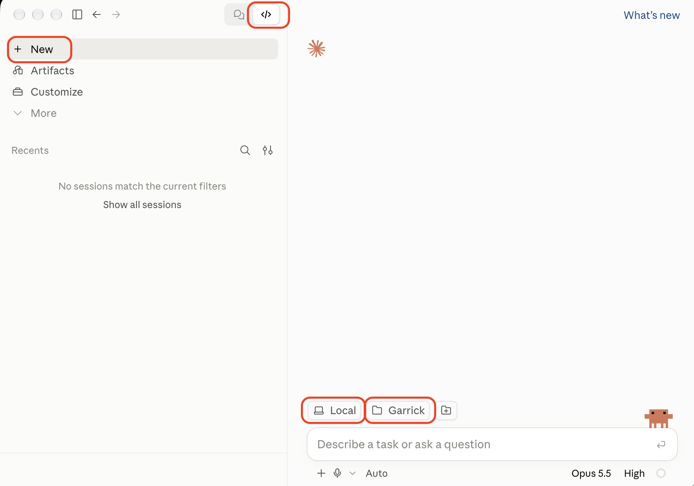
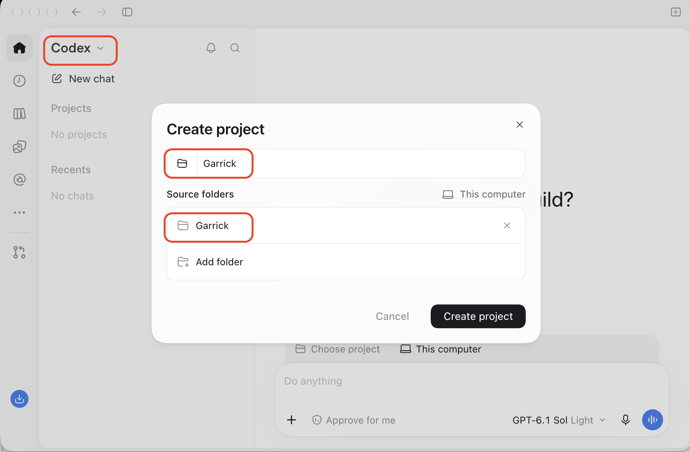

# First steps: setting up your Mac

This page is for you if you have never used Terminal. It gets your Mac ready for Garrick in about 30 minutes, most of it waiting for downloads.

There are two ways to talk to Garrick. The **Claude desktop app** is the easier one: after you've installed Garrick, you work in a normal app window, and you need Terminal only once. The **terminal route** is for people who already live in Terminal and is at the end of this page. Both run the same Claude Code and read the same workspace. If you use ChatGPT rather than Claude, Garrick works with Codex too: see [Using Codex instead](#using-codex-instead).

You need a Mac on macOS 13 or later, and a paid Claude plan (Pro or above). The free plan doesn't include Claude Code.

## 1. Install git and Python

Garrick keeps your work under git and runs a few small Python tools. Both come with Apple's command line tools, which you install from Terminal.

Open Terminal: press Command and Space together, type `Terminal`, and press Return. To run a command from this page, copy it, click in the Terminal window, paste with Command and V, and press Return.

```sh
xcode-select --install
```

A window asks whether to install the command line developer tools. Click Install and accept the licence. It takes 5 to 15 minutes. If Terminal says they are already installed, skip ahead. To check:

```sh
git --version
python3 --version
```

Each prints a version number. Python needs to be 3.9 or later.

## 2. Install the Claude app

Download Claude from [claude.com/download](https://claude.com/download), open the file, and drag Claude into Applications. Open it and sign in with the account that has your paid plan.

## 3. Set Claude up for private work (once)

Your workspace will hold material other people trusted you with, so check this before your first session. In the Claude app, open **Settings**, then **Privacy**, and turn **Help improve Claude** off. With it on, Anthropic may use your chats and coding sessions, Garrick sessions included, to train future models. The same setting covers the app, the website and Claude Code in Terminal, because it belongs to your account.

## 4. Get Garrick and install it

On the Garrick repository page, click **Code**, then **Download ZIP**. Double-click the ZIP in Downloads to unzip it. Then, in Terminal:

```sh
cd ~/Downloads/garrick-main
python3 install.py
```

The installer asks its questions one at a time. [Getting started](getting-started.md) explains each one, and a [guided session](guided-session.md) walks you through it with someone beside you. Your workspace goes into `~/Garrick`, so you can delete the ZIP and the unzipped folder afterwards. This is the last time you need Terminal.

## 5. Open your workspace in the Claude app



1. Click the **Code** icon, `</>`, at the top of the Claude window. The speech-bubble icon beside it is ordinary chat, which can't see your files.
2. Click **+ New** at the top of the left sidebar. The choices below can only be made before a session's first message, so always start from New.
3. Above the box where you type, click the first button and choose **Local**. It runs Claude on your Mac with your own files. The other choices run somewhere else and don't see your workspace.
4. Click the folder button beside it and choose your `Garrick` folder (Command, Shift and H jumps to your home folder). Choose the whole folder, not a zone inside it: the rules and skills live at its top. The button then reads **Garrick**, as in the picture.
5. Below the box, next to the microphone, click the mode and choose **Accept edits**. Claude then writes and updates your notes without asking each time, and still asks before running anything else, such as saving to git. The app remembers this for the folder.
6. Type `what's open` and press Return.

Two things to leave alone. Don't turn on "Allow bypass permissions mode" in Settings, which lets Claude run anything without asking. And if the app suggests creating a `CLAUDE.md`, don't: Garrick's instructions live in `AGENTS.md`, and a `CLAUDE.md` in the folder makes Claude stop reading them.

## 6. Turn on dictation

Garrick is built to be spoken to. In the Claude app, click the microphone below the box where you type, speak, and send. To speak anywhere else, Terminal included, turn on the Mac's own dictation: in System Settings, open Keyboard, turn on Dictation, and choose a shortcut.

## 7. Install Obsidian (optional)

Obsidian is a free app for reading your workspace as linked notes, and it has a phone app too. Garrick works without it. Download it from [obsidian.md](https://obsidian.md) and drag it into Applications, then choose "Open folder as vault" and pick your `Garrick` folder. [Obsidian](extras/obsidian.md) says which folder suits you best.

## 8. Route your mail (Gmail)

Garrick files mail you choose, not your whole mailbox. Every Gmail address already accepts a plus address with nothing to set up: mail to `you+work@gmail.com` arrives at `you@gmail.com`. Use one plus address per zone, and forward or copy to it only the mail you want filed.

A filter keeps that mail out of your Gmail inbox and gives it a label:

1. In Gmail on the web, click the settings icon beside the search bar ("Show search options").
2. In **To**, type `you+work@gmail.com`, with your own address.
3. Click **Create filter**.
4. Tick **Skip the Inbox (Archive it)** and **Apply the label**, then choose **New label** and name it `Garrick/Work`.
5. Click **Create filter**.

Repeat for each zone, for example `you+personal@gmail.com` with the label `Garrick/Personal`. For mail from one customer, partner or client, you can use their tag instead: `you+acme@gmail.com` tells Garrick the mail is Acme's.

The label collects the mail to be filed, so only mail you routed there can reach your workspace. [Ways in](extras/ways-in.md) has three ways to get labelled mail into a zone's `Inbox/` folder, and which accounts each one works with.

## Using Codex instead

Codex lives inside the ChatGPT desktop app, for Macs with Apple silicon, and comes with every ChatGPT plan. Download the app from [learn.chatgpt.com/docs/app](https://learn.chatgpt.com/docs/app) and sign in. Steps 1, 4, 6, 7 and 8 above stay the same; these replace steps 2, 3 and 5.

**Set it up for private work (once).** In ChatGPT, open **Settings**, then **Data Controls**, and turn **Improve the model for everyone** off. On a personal plan it covers Codex as well. Codex's own settings have a separate switch about training on full environments: turn that off too.



1. At the top of the sidebar, click the mode name and choose **Codex**.
2. Above the box where you type, click **Choose project** and create a new project.
3. Name it `Garrick`. Under **Source folders**, click **Add folder** and choose your `Garrick` folder, the whole folder, not a zone inside it. Leave **This computer** selected: it runs on your Mac with your own files.
4. Click **Create project**.
5. The setting below the box (**Approve for me** in the picture) decides what Codex does without asking. Choose a stricter one if you'd rather approve each step.
6. Type `what's open` and press Return.

## The terminal route

Instead of step 2, install Claude Code in Terminal:

```sh
curl -fsSL https://claude.ai/install.sh | bash
```

Close the Terminal window, open a new one, and check it with `claude --version`. This installer keeps Claude Code up to date on its own. If you already use Homebrew, `brew install --cask claude-code obsidian` installs both apps instead, but a Claude Code installed that way doesn't update itself: run `brew upgrade claude-code` now and then.

Instead of step 5, start each session from your workspace:

```sh
cd ~/Garrick
claude
```

The first time, Claude Code opens your browser to sign in, then asks whether you trust the files in this folder: answer yes. It asks before each change. Press Shift and Tab to switch to accepting edits. Step 3 applies unchanged.

## If something goes wrong

- **The Code tab asks you to upgrade:** your account is on the free plan. Claude Code needs Pro or above.
- **Claude doesn't seem to know your zones or projects:** check that you selected the `Garrick` folder itself, not a folder inside it, and that there is no `CLAUDE.md` in it.
- **`command not found` in Terminal after installing something:** close Terminal completely (Command and Q), open it again, and retry.
- **Terminal asks for a password and nothing appears as you type:** that is normal. Type your Mac password and press Return.
